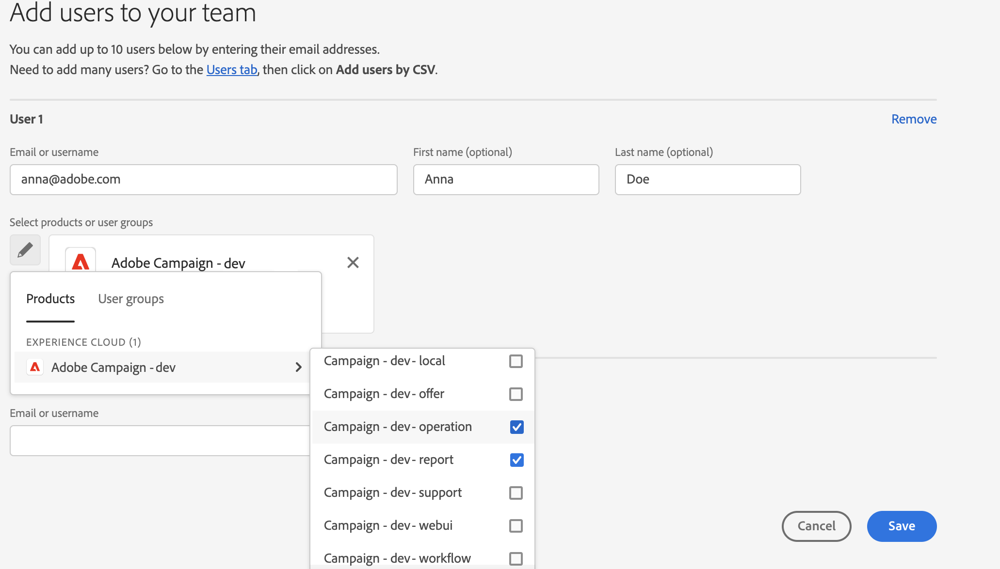

# 管理用户权限{#manage-permissions}

## 添加用户 {#add-users}

作为产品管理员，您可以添加用户并授予对Campaign的访问权限。

要添加用户，请执行以下步骤：

1. 在[Admin Console](https://adminconsole.adobe.com/enterprise){target="_blank"}主页中，选择&#x200B;**添加用户**。

   

1. 输入用户的电子邮件地址。
1. 使用“+”符号选择要分配给用户的产品配置文件或用户组。

   

   [此部分](#ootb-productprofiles)中列出了Campaign内置产品配置文件。

   在[本节](#user-groups)中了解如何创建用户组

1. 单击&#x200B;**保存**。 用户即被添加，并显示在“用户”列表中。 如果您为用户分配管理员角色或产品配置文件，用户将收到电子邮件通知。 用户必须单击该链接才能完成其个人资料。

在[此页面](https://helpx.adobe.com/ie/enterprise/using/manage-users-individually.html){target="_blank"}中了解有关在Admin Console中创建用户的更多信息。

当新用户[使用其Adobe ID登录Campaign](connect.md)时，他们将被添加到客户端控制台的Campaign操作员列表中。 Campaign运算符存储在Campaign资源管理器的&#x200B;**[!UICONTROL Administration > Access management > Operators]**&#x200B;文件夹中。

## 使用产品配置文件{#product-profiles}

使用产品配置文件授予用户使用产品中所含功能的权限。

* 对于Admin Console上的每个产品，您可以创建一个或多个产品配置文件。
* 在每个产品配置文件中，您都会分配用户和用户组（在您的组织中）。
* 当用户使用产品配置文件中指定的凭据登录时，将授予他们访问产品配置文件所基于的产品的应用程序和服务的权限。

这些产品配置文件与存储在Campaign资源管理器&#x200B;**[!UICONTROL Administration > Access management > Operator groups]**&#x200B;文件夹中的操作员组匹配。

在Admin Console中，产品配置文件使用以下语法：

campaign - `<your instance>` — 操作员组的内部名称

例如，对于“test”实例中的&#x200B;**Delivery operator**&#x200B;组，Admin Console中的产品配置文件是：

campaign — 测试 — 交付

您可以使用默认的产品配置文件或创建新产品配置文件。

### 创建产品配置文件{#create-product-profile}

要向Adobe添加新产品配置文件，您必须首先在Campaign客户端控制台中创建它，然后将其添加到Admin Console。

例如，要创建“审阅者”产品配置文件，请执行以下步骤。

#### 在Campaign中创建运算符组{#create-op-group}

1. 连接到Campaign，打开资源管理器，然后浏览到&#x200B;**[!UICONTROL Administration > Access management > Operator groups]**。
1. 单击&#x200B;**[!UICONTROL New]**，定义操作员组的名称并设置其内部名称（“审阅者”）。
   
1. 通过选择已命名权限来定义关联的权限。 [此部分](#use-named-rights)中详细介绍了已命名权限
1. 保存新的操作员组。

#### 在Admin Console中创建产品配置文件{#create-profile-in-admin-console}

1. 连接到[Admin Console](https://adminconsole.adobe.com/enterprise){target="_blank"}。
1. 从主页的&#x200B;**产品和服务**&#x200B;部分，打开Campaign产品。
1. 单击&#x200B;**新建配置文件**，然后输入要创建的产品配置文件的名称，其语法完全正确，如[此处](#product-profiles)所述。 例如，我们输入：营销活动 — `<your-instance-name>` — 审阅者

   

1. 保存您的更改。

您现在可以将用户添加到此新产品配置文件，如[此部分](#add-users)中所述。

最佳实践为将产品配置文件分配给用户组。 按用户管理权限不是一种可持续的模式。

### 默认产品配置文件和操作员组 {#ootb-productprofiles}

Adobe Campaign附带在Adobe启用您的环境时定义的内置&#x200B;**产品配置文件**。

这些产品配置文件与Campaign **操作员组**&#x200B;匹配。 默认操作员组及其[已命名权限](#use-named-rights)如下所列：

1. **[!UICONTROL Administrator]** （管理员）

   此组中的操作员具有实例的完全访问权限。 管理员是可以访问用户界面中最技术部分的用户。

   此组包含以下已命名权限：

   * **[!UICONTROL ADMINISTRATION]**：有权执行/创建/编辑/删除任何对象，如工作流、投放、脚本等。

   >[!IMPORTANT]
   >
   >**[!UICONTROL Administrator]**&#x200B;角色授予对Campaign控制面板的访问权限。 Adobe Admin Console中的任何产品配置文件在其名称中包含“管理员”一词（如“管理员”、“管理员”、“管理员”、“审批管理员”等），均将授予对控制面板的访问权限。 了解有关[管理控制面板访问权限](https://experienceleague.adobe.com/docs/control-panel/using/discover-control-panel/managing-permissions.html){target="_blank"}的更多信息。

1. **[!UICONTROL Delivery operators]** （投放）

   此组中的操作员负责管理投放：他们可访问创建和准备投放所需的主要资源（活动类型、投放映射、默认模板、个性化块等）。

   此组包含以下已命名权限：

   * **[!UICONTROL PREPARE DELIVERIES]**：有权创建、编辑和启动投放分析，
   * **[!UICONTROL START DELIVERIES]**：有权批准以前分析的投放。

1. **[!UICONTROL Campaign managers]** （操作）

   此组中的操作员可以管理营销活动：通过此组，您可以访问&#x200B;**[!UICONTROL Campaign]**(可选Adobe Campaign模块)框架内链接到营销活动的对象（计划、项目、工作流、预算等）。

   此组包含以下已命名权限：

   * **[!UICONTROL INSERT FOLDERS]**：有权将文件夹插入到Adobe Campaign树中（前提是您对有关分支具有编辑权限），
   * **[!UICONTROL WORKFLOW]**：使用工作流的权限。

   >[!NOTE]
   >
   >此组不允许操作员开始投放。

1. **[!UICONTROL Content contributors]** （内容）

   此组中的用户可以访问&#x200B;**[!UICONTROL Content management]**&#x200B;加载项上下文中的内容文件夹。 此组不授予任何其他权限。

1. **[!UICONTROL Access to reports]** （报告）

   此组是为外部操作员保留的，用于通过[Web访问](../start/campaign-ui.md#web-browser)访问投放报告。

1. **[!UICONTROL Workflow execution]** （工作流）

   通过&#x200B;**[!UICONTROL Workflow execution]**&#x200B;组，您可以控制定位工作流的执行和批准：命名权限的工作流将映射到此组的操作员。 除了对数据文件的访问权限之外，需要对工作流执行所有操作。 默认情况下，**[!UICONTROL Workflow execution]**&#x200B;组对标准定位工作流文件和工作流模板具有只读访问权限。 此组中的操作员还具有对待处理审批文件的读写访问权限。

1. **[!UICONTROL Workflow supervisors]** (workflowSupervisor)

   此组中的用户管理工作流批准，并在出现与活动工作流相关的警报时收到电子邮件通知。

1. **本地/中央管理** （中央/本地）

   此组中的用户可以使用&#x200B;**[!UICONTROL Distributed marketing]**&#x200B;加载项。

1. **[!UICONTROL Offer managers]** （选件）

   此组中的操作员可以在使用交互加载项时创建和维护优惠。 [了解详情](../interaction/interaction-operators.md)。

   此组包含以下已命名权限：

   * **[!UICONTROL INSERT FOLDERS]**：有权将文件夹插入到Adobe Campaign树中（前提是您对有关分支具有编辑权限），
   * **[!UICONTROL EDIT FOLDERS]**：更改文件夹属性（如内部名称、标签、关联的图像、子文件夹顺序等）的权限。

   分配给选件管理器的权限允许他们执行以下任务：

   * 修改&#x200B;**[!UICONTROL Design]**&#x200B;环境。
   * 查看&#x200B;**[!UICONTROL Live]**&#x200B;环境。
   * 配置管理函数（预定义的空间和过滤器）。
   * 创建和更新类别。
   * 创建选件。
   * 配置优惠资格。
   * 批准选件。

   >[!NOTE]
   >
   >**如果未指定审阅者，或者在优惠模板中已将优惠经理设置为审阅者，则**&#x200B;只能批准优惠。

   [此页面](../interaction/interaction-operators.md#recap-of-rights-according-to-operator)中提供了每个环境的选件管理器权限矩阵。

## 使用用户组{#user-groups}

您可以使用Admin Console创建用户组并将用户分配给这些用户组。

用户组是必须获得一组共享权限的不同用户的集合。 在[本节](https://helpx.adobe.com/ie/enterprise/using/user-groups.html){target="_blank"}中了解如何创建用户组。

您可以将产品配置文件分配给用户组。 因此，该组中的所有用户都将获得同一组产品权限。

## 已命名权限{#use-named-rights}

Adobe Campaign提供了一组已命名权限，允许您定义分配给用户和用户组的权限。 这些权限可以从Campaign资源管理器的&#x200B;**[!UICONTROL Administration > Access management > Named rights]**&#x200B;文件夹中编辑。

已命名权限将权限授予：

* 执行操作
例如，为具有&#x200B;**准备投放**&#x200B;命名权限的&#x200B;**投放操作员**&#x200B;组的成员激活投放编辑器中的&#x200B;**分析**&#x200B;按钮

* 对文件夹的访问权限
操作员组成员资格可以通过更改文件夹的安全性设置来授予或限制对文件夹的访问权限。 [了解详情](folder-permissions.md#restrict-access-to-a-folder)。

  例如，它可以影响：**写访问权限**&#x200B;以创建新实体（例如投放、配置文件等），**读访问权限**&#x200B;以使用实体，**删除访问权限**&#x200B;以删除实体。

Adobe Campaign中的默认命名权限包括：

* **[!UICONTROL ADMINISTRATION]**：具有&#x200B;**[!UICONTROL ADMINISTRATION]**&#x200B;权限的操作员对该实例具有完全访问权限。 管理员用户可以执行/创建/编辑/删除任何对象，例如工作流、投放、脚本等。 **注意：** Adobe Admin Console中的产品配置文件（包含“管理员”一词）可授予对Campaign控制面板的访问权限。

* **[!UICONTROL APPROVAL ADMINISTRATION]**：您可以在工作流和投放中设置多个批准步骤，以确保当前状态已由分配的操作员或组批准。 具有&#x200B;**[!UICONTROL APPROVAL ADMINISTRATION]**&#x200B;权限的用户可以设置批准步骤，还可以分配应批准这些步骤的操作员或操作员组。 **注意：**&#x200B;包含“管理员”一词的产品配置文件（如“审批管理员”）授予访问Campaign控制面板的权限。

* **[!UICONTROL CENTRAL]**：集中管理（分布式营销）权限。

* **[!UICONTROL DELETE FOLDER]**：有权删除文件夹。 使用此权限，用户可以从资源管理器视图中删除文件夹。

* **[!UICONTROL EDIT FOLDERS]**：更改文件夹属性（如内部名称、标签、关联的图像、子文件夹顺序等）的权限。

* **[!UICONTROL EXPORT]**：用户可以使用&#x200B;**[!UICONTROL EXPORT]**&#x200B;工作流活动，将数据从其Adobe Campaign实例导出到服务器或本地计算机上的文件中。

* **[!UICONTROL FILES ACCESS]**：有权通过脚本读取和写入文件，该脚本可在&#x200B;**[!UICONTROL JavaScript]**&#x200B;工作流活动中写入以读取/写入服务器上的文件。

* **[!UICONTROL IMPORT]**：通用数据导入权限。 **[!UICONTROL IMPORT]**&#x200B;允许您将数据导入任何其他表，而&#x200B;**[!UICONTROL RECIPIENT IMPORT]**&#x200B;权限仅允许将数据导入收件人表。

* **[!UICONTROL INSERT FOLDERS]**：有权插入文件夹。 具有&#x200B;**[!UICONTROL INSERT FOLDERS]**&#x200B;权限的用户可以在资源管理器视图的文件夹树中创建新文件夹。

* **[!UICONTROL LOCAL]**：本地管理权限（分布式营销）。

* **[!UICONTROL MERGE]**：有权将选定记录合并为一个。 如果收件人作为重复项存在，则通过&#x200B;**[!UICONTROL MERGE]**&#x200B;权限，用户可以选择重复项并将其合并到主收件人中。

* **[!UICONTROL PREPARE DELIVERIES]**：有权创建、编辑和保存投放。 具有&#x200B;**[!UICONTROL PREPARE DELIVERIES]**&#x200B;权限的用户也可以启动投放分析流程。

* **[!UICONTROL PRIVACY DATA RIGHT]**：有权收集和删除隐私数据。 [了解详情](privacy.md)。

* **[!UICONTROL PROGRAM EXECUTION]**：有权执行各种编程语言的命令。

* **[!UICONTROL RECIPIENT IMPORT]**：有权导入收件人。 具有&#x200B;**[!UICONTROL RECIPIENT IMPORT]**&#x200B;权限的用户可以将本地文件导入收件人表。

* **[!UICONTROL SQL SCRIPT EXECUTION]**&#x200B;直接在数据库上执行任何SQL命令的权限。

* **[!UICONTROL START DELIVERIES]**：有权批准以前分析的投放。 投放分析后，投放将在各种审批步骤暂停，并且需要获得审批才能恢复。 允许具有&#x200B;**[!UICONTROL START DELIVERIES]**&#x200B;权限的用户批准投放。

* **[!UICONTROL USE SQL DATA MANAGEMENT ACTIVITY]**：有权使用SQL数据管理活动编写您自己的SQL脚本，以便创建和填充工作表。 [了解详情](../../automation/workflow/sql-data-management.md)。

* **[!UICONTROL WORKFLOW]**：此命名权限特定于工作流：它允许您创建、启动和停止工作流。 已命名权限需要工作流文件的读取权限才能适用。 对于定位工作流，需要对&#x200B;**[!UICONTROL Profiles and Targets]**&#x200B;文件夹具有读取权限。

* **[!UICONTROL WEBAPP]**：有权使用Web应用程序。

>[!NOTE]
>
>此列表可能会因环境中安装的加载项而异。

## 其他资源{#additional-res}

* [管理工作流的权限](../../automation/workflow/managing-rights.md)
* [管理分布式营销的权限](../../automation/distributed-marketing/about-distributed-marketing.md#operators)
* [管理交互模块的权限](../interaction/interaction-operators.md)
* [筛选对架构的访问权限](../dev/filter-schema.md)
* [限制 PI 视图](../dev/restrict-pi-view.md)
