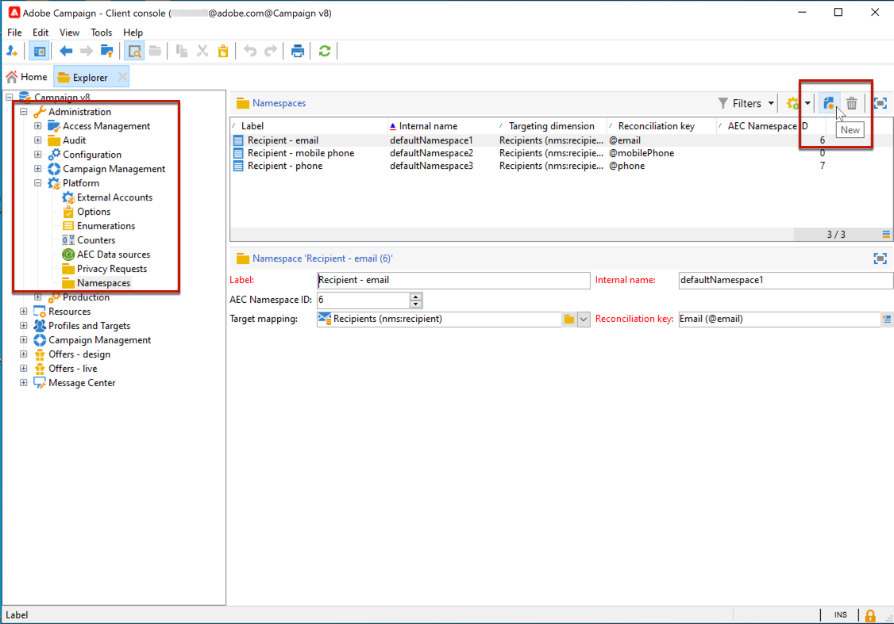

# 在 Campaign 中管理隐私请求 {#privacy}

根据您的业务性质及运营所在的司法管辖区，您的数据运营可能会受到隐私法规的约束。这些法规通常赋予您的客户请求访问您从他们那里收集的数据的权利，并且这些客户有权请求删除所存储的数据。在整个文档中，这些客户对其个人数据的请求都称为“隐私请求”。

Adobe 为数据控制者提供相应的工具，用于创建和处理与 Campaign 中的存储数据有关的隐私请求。但是，作为数据控制者，您有责任确认发出请求的数据主体的身份，并确认返回给请求者的数据与数据主体相关。進一步瞭解個人資料及管理資料的不同實體 [Adobe Campaign Classic v7檔案](https://experienceleague.adobe.com/docs/campaign-classic/using/getting-started/privacy/privacy-and-recommendations.html?lang=zh-Hans#personal-data){target="_blank"}.


要在 Campaign 中管理隐私请求，必须先[定义命名空间](#namespaces)。然后，才能创建和管理隐私请求。要执行隐私请求，请使用 **Adobe Privacy Service** 集成。从 Privacy Service 推送到所有 Adobe Experience Cloud 解决方案的隐私请求由 Campaign 通过专门工作流自动处理。[了解详情](#create-privacy-request)

 瞭解 **存取許可權** 和 **被遺忘權** （刪除請求）於 [Adobe Campaign Classic v7檔案](https://experienceleague.adobe.com/docs/campaign-classic/using/getting-started/privacy/privacy-management.html?lang=zh-Hans#right-access-forgotten){target="_blank"}.


>[!NOTE]
>
>从 Campaign v8.3 开始提供此功能。要检查您的版本，请参阅[此部分](compatibility-matrix.md#how-to-check-your-campaign-version-and-buildversion)

## 定义命名空间 {#namespaces}

在创建隐私请求之前，必须&#x200B;**定义要使用的命名空间**。命名空间是用于识别数据库中的数据主体的键。

>[!NOTE]
>
>要了解有关身份命名空间的更多信息，请参阅 [Adobe Experience Platform文档](https://experienceleague.adobe.com/docs/experience-platform/identity/namespaces.html?lang=zh-Hans){target="_blank"}.

当前，Adobe Campaign 不支持从 Experience Platform Identity Namespace Service 导入命名空间。因此，在 Identity Namespace Service 上创建命名空间后，必须在 Adobe Campaign 界面中手动创建相应的命名空间。为此，请执行以下步骤：

<!--v7?
Three namespaces are available out-of-the-box: email, phone and mobile phone. If you need a different namespace (a recipient custom field, for example), you can create a new one from **[!UICONTROL Administration]** > **[!UICONTROL Platform]** > **[!UICONTROL Namespaces]**.

>[!NOTE]
>
>For optimal performance, it is recommended to use out-of-the-box namespaces.
-->

1. 在上建立名稱空間 [身分名稱空間服務](https://developer.adobe.com/experience-platform-apis/references/identity-service/#tag/Identity-Namespace){target="_blank"}.

1. 時間 [列出身分名稱空間](https://developer.adobe.com/experience-platform-apis/references/identity-service/#operation/getIdNamespaces){target="_blank"} 可供您的組織使用，您將獲得以下名稱空間詳細資訊，例如：

   ```
   {
           "updateTime": 1632903236731,
           "code": "lumanamespace",
           "status": "ACTIVE",
           "description": "new namespace for Luma privacy requests",
           "id": 10998717,
           "createTime": 1632903236731,
           "idType": "Email",
           "namespaceType": "Custom",
           "name": "Luma Namespace",
           "custom": true
   }
   ```

1. 在 Adobe Campaign 中，转到 **[!UICONTROL Administration]** > **[!UICONTROL Platform]** > **[!UICONTROL Namespaces]** 并选择 **[!UICONTROL New]**。

   

1. 输入 **[!UICONTROL Label]**。

1. 填写新命名空间的详细信息，以匹配您在 Identitiy Namespace Service 上创建的命名空间：

   * **[!UICONTROL AEC Namespace ID]** 必须匹配“id”属性
   * **[!UICONTROL Internal name]** 必须匹配“code”属性
   * **[!UICONTROL Reconciliation key]** 必须匹配“idType”属性

   

   **[!UICONTROL Reconciliation key]** 字段是将用于识别 Adobe Campaign 数据库中的“数据主体”的字段。

1. 选择目标映射 <!--(**[!UICONTROL Recipients]**, **[!UICONTROL Real time event]** or **[!UICONTROL Subscriptions]**)-->，以指定在 Adobe Campaign 中合并命名空间的方式。

   >[!NOTE]
   >
   >如果需要使用多个目标映射，请为每个目标映射创建一个命名空间。

1. 保存更改。

现在，您可以根据新命名空间创建隐私请求。如果使用多个命名空间，请为同一个合并值的每个命名空间创建一个隐私请求。

## 创建隐私请求 {#create-privacy-request}

借助 **[!DNL Adobe Experience Platform Privacy Service]** 集成，您可以通过单个 JSON API 调用在多解决方案上下文中自动处理隐私请求。Adobe Campaign 会自动通过专用工作流处理从 Privacy Service 推送的请求。

请参阅 [Experience Platform Privacy Service](https://experienceleague.adobe.com/docs/experience-platform/privacy/home.html) 文档，以了解如何从隐私核心服务创建隐私请求。{target="_blank"}

每个 **[!DNL Privacy Service]** 任务根据使用的命名空间数在 Adobe Campaign 中拆分为多个隐私请求，一个请求对应一个命名空间。

此外，一个作业可以在多个实例上运行。因此，将为一个作业创建多个文件。例如，如果某个请求具有两个命名空间，并且在三个实例上运行，则总共发送六个文件。每个命名空间和实例一个文件。

文件名的模式为：`<InstanceName>-<NamespaceId>-<ReconciliationKey>.xml`

* **InstanceName**：Campaign 实例名称
* **NamespaceId**：已使用的命名空间的身份服务命名空间 ID
* **Reconciliation key**：编码的合并关键项

>[!CAUTION]
>
>若要使用自訂名稱空間型別提交請求，請利用 [JSON方法](https://experienceleague.adobe.com/docs/experience-platform/privacy/ui/user-guide.html#json){target="_blank"} and add the namespaceId to the request, or use the [API call](https://experienceleague.adobe.com/docs/experience-platform/privacy/api/privacy-jobs.html#access-delete){target="_blank"} 以提出要求。
>
>僅使用 [隱私權使用者介面](https://experienceleague.adobe.com/docs/experience-platform/privacy/ui/user-guide.html#request-builder){target="_blank"} 以使用標準名稱空間型別提交請求。

### 处理请求时搜索的表 {#list-of-tables}

执行删除或访问隐私请求时，Adobe Campaign 会根据所有具有指向收件人表（自有类型）链接的表中的 **[!UICONTROL Reconciliation value]** 搜索所有数据主体数据。

执行隐私请求时要考虑的内置表列表包括：

* 收件人 (recipient)
* 收件人投放日志 (broadLogRcp)
* 收件人跟踪日志 (trackingLogRcp)
* 归档的事件投放日志 (broadLogEventHisto)
* 收件人列表内容 (rcpGrpRel)
* 访客优惠建议 (propositionVisitor)
* 访客 (visitor)
* 订阅历史记录 (subHisto)
* 订阅 (subscription)
* 收件人优惠建议 (propositionRcp)

如果您创建的自定义表单具有指向收件人表（自有类型）的链接，则也会考虑这些资源。例如，如果您具有链接到收件人表的事务表和链接到该事务表的事务详细信息表，则这两个表都将被考虑在内。
<!--
>[!CAUTION]
>
>If you perform Privacy batch requests using profile deletion workflows, please take into consideration the following remarks:
>* Profile deletion via workflows do not process children tables.
>* You need to handle the deletion for all the children tables.
>* Adobe recommends that you create an ETL workflow that add the lines to delete in the Privacy Access table and let the **[!UICONTROL Delete privacy requests data]** workflow perform the deletion. We suggest to limit to 200 profiles per day to delete for performance reasons.-->

### 隐私请求状态 {#privacy-request-statuses}

您可以在下面找到 Adobe Campaign 中隐私请求的不同状态以及其解释方式：

* **[!UICONTROL New]** / **[!UICONTROL Retry pending]**：进行中，工作流尚未处理请求。
* **[!UICONTROL Processing]** / **[!UICONTROL Retry in progress]**：工作流正在处理请求。
* **[!UICONTROL Delete pending]**：工作流已识别要删除的所有收件人数据。
* **[!UICONTROL Delete in progress]**：工作流正在处理删除。
* **[!UICONTROL Complete]**：请求的处理已完成，并且没有错误。
* **[!UICONTROL Error]**：工作流遇到错误。原因显示在 **[!UICONTROL Request status]** 列的隐私请求列表中。例如，**[!UICONTROL Error data not found]** 表示在数据库中找不到与数据主体的 **[!UICONTROL Reconciliation value]** 匹配的收件人数据。

**Campaign Classic v7 文档中的相关主题：**

* [隐私和同意](https://experienceleague.adobe.com/docs/campaign-classic/using/getting-started/privacy/privacy-and-recommendations.html?lang=zh-Hans){target="_blank"}

* [隱私權管理快速入門](https://experienceleague.adobe.com/docs/campaign-classic/using/getting-started/privacy/privacy-management.html?lang=zh-Hans){target="_blank"}

* [隱私權管理法規](https://experienceleague.adobe.com/docs/campaign-classic/using/getting-started/privacy/privacy-management.html?lang=zh-Hans#privacy-management-regulations){target="_blank"} （GDPR、CCPA、PDPA及LGPD）

* [選擇退出個人資訊銷售](https://experienceleague.adobe.com/docs/campaign-classic/using/getting-started/privacy/privacy-requests/privacy-requests-ccpa.html?lang=zh-Hans){target="_blank"} （特定於CCPA）
