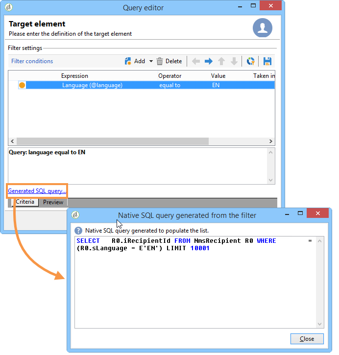

# 查询营销活动数据库

您可在软件的多个级别上找到 Adobe Campaign 查询工具：创建目标群体、细分客户、提取和过滤跟踪日志、构建过滤器等。

Adobe Campaign查询工具允许您使用专用助手（即通用查询编辑器）查询数据库。 通过&#x200B;**[!UICONTROL Tools > Generic query editor...]**&#x200B;菜单访问。 它可让您提取数据库中存储的信息，将其整理、分组、排序等。例如，用户可以找到在给定的期间内，在新闻稿的链接上点击超过 n 次的收件人。通过这个工具，您可根据自己的需求收集、排序和显示结果。

此工具结合了 Adobe Campaign 所有可能的查询方式。例如，您可以创建和保存限制过滤器。这意味着在定位工作流等的 Query 框中可以使用在通用查询编辑器中创建的用户过滤器。

使用所选表的字段或使用公式可以创建查询。

在Adobe Campaign中构建查询的步骤如下所示：

1. 选择工作表。 请参阅[步骤1 — 选择表](#step-1---choose-a-table)。
1. 选择要提取的数据。 请参阅[步骤2 — 选择要提取的数据](#step-2---choose-data-to-extract)。
1. 定义数据排序顺序。 请参阅[步骤3 — 对数据进行排序](#step-3---sort-data)。
1. 筛选数据。 请参阅[步骤4 — 筛选数据](#step-4---filter-data)。
1. 设置数据格式。 请参阅[步骤5 — 格式化数据](#step-5---format-data)。
1. 显示结果。 请参阅[步骤6 — 预览数据](#step-6---preview-data)。

>[!NOTE]
>
>* 所有这些步骤在通用查询编辑器中均可用。 在另一个上下文中创建查询时，可能会省略一些步骤。
>
>* 要了解有关查询以及如何创建查询的更多信息，请参阅[Campaign工作流文档](../../automation/workflow/query.md)。

要查询Campaign数据库，请打开&#x200B;**通用查询编辑器**，然后执行以下步骤：

## 第1步 — 选择表 {#step-1---choose-a-table}

选择包含要在&#x200B;**[!UICONTROL Document type]**&#x200B;窗口中查询的数据的表。 如果需要，请使用筛选器字段或&#x200B;**[!UICONTROL Filters]**&#x200B;按钮筛选数据。

## 步骤2 — 选择要提取的数据 {#step-2---choose-data-to-extract}

在&#x200B;**[!UICONTROL Data to extract]**&#x200B;窗口中，选择要显示的数据：这些字段将构成输出列。

例如，选择&#x200B;**[!UICONTROL Age]**、**[!UICONTROL Primary key]**、**[!UICONTROL Email domain]**&#x200B;和&#x200B;**[!UICONTROL City]**。 结果将根据此选择进行组织。 使用窗口右侧的蓝色箭头可更改列顺序。

可以通过将公式插入表达式中或对聚合函数运行进程来编辑表达式。 为此，请单击&#x200B;**[!UICONTROL Expression]**&#x200B;列字段，然后选择&#x200B;**[!UICONTROL Edit expression]**。

您可以对输出列数据进行分组：为此，请检查&#x200B;**[!UICONTROL Yes]**&#x200B;窗口的&#x200B;**[!UICONTROL Group]**&#x200B;列中的&#x200B;**[!UICONTROL Data to extract]**。 此函数围绕选中的分组轴生成结果。 [此节](../../automation/workflow/query-delivery-info.md)中提供了包含分组的查询示例。

* **[!UICONTROL Handle groupings (GROUP BY + HAVING)]**&#x200B;函数允许您“分组依据”并选择已经分组的内容（“具有”）。 此函数应用于输出列中的所有字段。 例如，此选项允许您对输出列的所有选择进行分组，并恢复特定类型的信息，例如介于35和50之间的收件人。

  如需详细信息，请参阅[此小节](../../automation/workflow/query-grouping-management.md)。

* **[!UICONTROL Remove duplicate rows (DISTINCT)]**&#x200B;函数允许您删除在输出列中获得的相同结果的重复项。 例如，如果选择输出列中的“姓氏”、“名字”和“电子邮件”字段进行人口普查，则数据相同的联系人将被删除，因为这意味着同一联系人已在数据库中输入多次：只考虑一个结果。

## 步骤3 — 排序数据 {#step-3---sort-data}

**[!UICONTROL Sorting]**&#x200B;窗口允许您对列内容进行排序。 使用箭头可更改列顺序：

* **[!UICONTROL Sorting]**&#x200B;列启用简单排序并按从A到Z或升序排列列内容。
* **[!UICONTROL Descending sort]**&#x200B;将内容从Z到A按降序排列。 这对于查看记录销售额非常有用，例如：最高数字显示在列表顶部。

在此示例中，数据根据收件人年龄按升序排序。

## 第4步 — 筛选数据 {#step-4---filter-data}

利用查询编辑器，可筛选数据以优化搜索。

提供的过滤器取决于查询涉及的表。

选择&#x200B;**[!UICONTROL Filtering conditions]**&#x200B;后，您将访问&#x200B;**[!UICONTROL Target elements]**&#x200B;部分：这允许您定义如何筛选要收集的数据。

* 要创建新筛选器，请选择创建要验证的公式所需的字段、运算符和值，以便选择数据。 您还可以合并多个条件，如此页面[上的](filter-conditions.md)详细信息。
* 要使用以前保存的筛选器，请单击&#x200B;**[!UICONTROL Add]**&#x200B;按钮打开下拉列表，单击&#x200B;**[!UICONTROL Predefined filter]**&#x200B;并选择所需的筛选器。

  

* 在&#x200B;**[!UICONTROL Generic query editor]**&#x200B;中创建的筛选器可用于其他查询应用程序，反之亦然。 要保存筛选器，请单击&#x200B;**[!UICONTROL Save]**&#x200B;图标。

  >[!NOTE]
  >
  >有关创建和使用筛选器的详细信息，请参阅[筛选选项](filter-conditions.md)。

如以下示例所示，要恢复所有说英语的收件人，请选择“收件人语言&#x200B;**等于** EN”。

>[!NOTE]
>
>您可以通过在&#x200B;**值**&#x200B;字段中键入以下公式来直接访问选项： **$(options:OPTION_NAME)**。

单击&#x200B;**[!UICONTROL Preview]**&#x200B;选项卡以查看筛选条件的结果。 在这种情况下，所有说英语的收件人都会显示其姓名、名字和电子邮件地址。

熟悉SQL语言的用户可以单击&#x200B;**[!UICONTROL Generate SQL query]**&#x200B;查看SQL中的查询。

## 步骤5 — 设置数据格式 {#step-5---format-data}

配置限制筛选器后，您将访问&#x200B;**[!UICONTROL Data formatting]**&#x200B;窗口。 通过此窗口，您可以重新排列输出列、转换数据以及更改列标签的大写/小写。 它还允许您使用计算字段将公式应用于最终结果。

>[!NOTE]
>
>有关计算字段类型的详细信息，请参阅[创建计算字段](filter-conditions.md#creating-calculated-fields)。

未选中的列将不会显示在数据预览窗口中。

通过&#x200B;**[!UICONTROL Transformation]**&#x200B;列，可将列标签更改为大写或小写。 选择该列并单击&#x200B;**[!UICONTROL Transformation]**&#x200B;列中的。 您可以选择：

* **[!UICONTROL Switch to lower case]**，
* **[!UICONTROL Switch to upper case]**，
* **[!UICONTROL First letter in upper case]**。

## 步骤6 — 预览数据 {#step-6---preview-data}

**[!UICONTROL Data preview]**&#x200B;窗口是最后一个阶段。 单击&#x200B;**[!UICONTROL Start the preview of the data]**&#x200B;以获取您的查询结果。 它以列或XML格式提供。 单击&#x200B;**[!UICONTROL Generated SQL queries]**&#x200B;选项卡以查看SQL格式的查询。

在此示例中，数据根据收件人年龄按升序排序。

>[!NOTE]
>
>默认情况下，**[!UICONTROL Data preview]**&#x200B;窗口中仅显示前200行。 若要更改此设置，请在&#x200B;**[!UICONTROL Lines to display]**&#x200B;框中输入一个数字，然后单击&#x200B;**[!UICONTROL Start the preview of the data]**。

**相关主题**

* [工作流查询活动](../../automation/workflow/query.md)
* [查询收件人表](../../automation/workflow/querying-recipient-table.md)
* [筛选条件](filter-conditions.md)