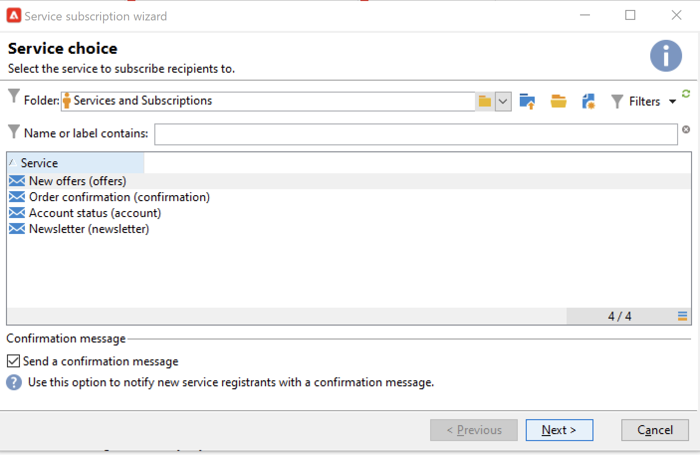
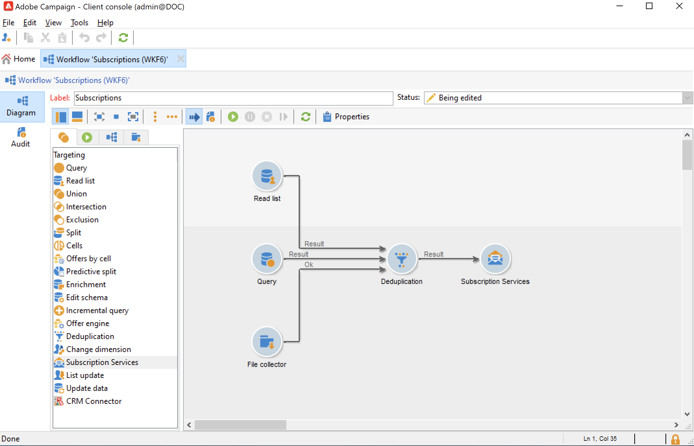

# 管理订阅和退订 {#optin-optout}

使用Adobe Campaign创建和监控信息服务（如新闻稿），并管理这些服务的订阅/退订。 可以并行定义多种服务，例如：特定产品类别、网站主题或区域的专业通讯、各种类型警报消息的订阅和实时通知。

请参阅[Campaign Classicv7文档](https://experienceleague.adobe.com/docs/campaign-classic/using/sending-messages/subscriptions-and-referrals/managing-subscriptions.html?lang=zh-Hans){target="_blank"}以了解如何创建信息服务、发送新闻稿以及管理选择加入和选择退出

要订阅（选择加入）服务配置文件，可用选项包括：

* 手动将服务添加到收件人配置文件：要执行此操作，从其配置文件的&#x200B;**[!UICONTROL Subscriptions]**&#x200B;选项卡中，单击&#x200B;**[!UICONTROL Add]**&#x200B;并选择相关的信息服务。

  

  请参阅 [Campaign Classic v7 文档](https://experienceleague.adobe.com/docs/campaign-classic/using/getting-started/profile-management/editing-a-profile.html?lang=zh-Hans#deliveries-tab){target="_blank"}以了解详情

* 自动为一组收件人订阅该服务。 收件人列表可能来自筛选操作、组、文件夹、导入或直接手动选择。 要订阅这些收件人，请选择用户档案并右键单击。 选择 **[!UICONTROL Actions > Subscribe selection to a service...]**。

  

  选择相关的服务，然后启动操作。

  

  请参阅 [Campaign Classic v7 文档](https://experienceleague.adobe.com/docs/campaign-classic/using/getting-started/profile-management/editing-a-profile.html?lang=zh-Hans#deliveries-tab){target="_blank"}以了解详情

* 导入收件人并自动为其订阅信息服务。 要执行此操作，请在导入向导的最后一步中选择相关的服务。

  请参阅[Campaign Classicv7文档](https://experienceleague.adobe.com/docs/campaign-classic/using/getting-started/importing-and-exporting-data/generic-imports-exports/executing-import-jobs.html?lang=zh-Hans#step-5---additional-step-when-importing-recipients){target="_blank"}以了解详情。

* 使用Web窗体，以便收件人可以订阅服务。

  

  Campaign附带一个默认Web表单以管理选择加入。 您可以对其进行个性化并映射配置文件数据。

  

  请参阅[Campaign Classicv7文档](https://experienceleague.adobe.com/docs/campaign-classic/using/designing-content/web-forms/use-cases--web-forms.html?lang=zh-Hans#create-a-subscription--form-with-double-opt-in){target="_blank"}以了解详情。

* 创建定位工作流并使用&#x200B;**[!UICONTROL Subscription service]**&#x200B;活动。

  

  在[此页面](https://experienceleague.adobe.com/docs/campaign/automation/workflows/wf-activities/targeting-activities/subscription-services.html?lang=zh-Hans){target="_blank"}中了解详情。

要取消订阅（选择退出）服务的配置文件，可用选项包括：

**手动取消订阅**

* 个性化退订链接或Web窗体
* 手动删除信息服务
* 从特定订阅服务中手动删除收件人

**自动取消订阅**

* 指定信息服务的持续时间限制：当有效期到期后，将自动取消订阅收件人。 此时间段在服务属性的“编辑”选项卡中指定。 以天为单位表示。
* 为群体设置退订工作流。

请参阅[Campaign Classicv7文档](https://experienceleague.adobe.com/docs/campaign-classic/using/sending-messages/subscriptions-and-referrals/managing-subscriptions.html?lang=zh-Hans#unsubscribing-a-recipient-from-a-service){target="_blank"}以了解详情。

>[!CAUTION]
>
>在[企业(FFDA)部署](../architecture/enterprise-deployment.md)的上下文中，订阅和取消订阅是&#x200B;**异步**&#x200B;进程。 选择启用和选择禁用请求每小时处理一次。 [了解详情](../architecture/new-apis.md#sub-apis)

<!--
You can also enable your delivery recipients to forward messages to a friend. To do this, insert the relevant links into your delivery. You may then track this sharing process as well as the number of visits to the concerned pages. 

For more on this capability, refer to [Campaign Classic v7 documentation](https://experienceleague.adobe.com/docs/campaign-classic/using/sending-messages/subscriptions-and-referrals/viral-and-social-marketing.html?lang=zh-Hans#viral-marketing--forward-to-a-friend){target="_blank"}
-->
