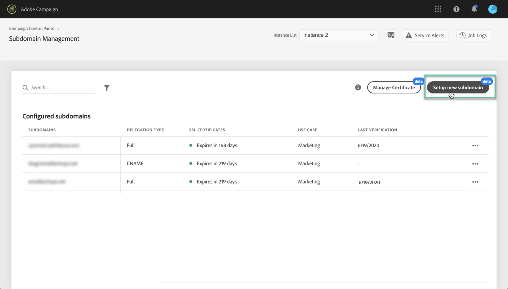

# Adobe Campaign v8 有哪些新增功能？ {#ac-gs-what-is-new}

Adobe Campaign v8 在基础架构、安全性、可投放性和监测方面有着显著改进。通过利用 [[!DNL Snowflake]](https://www.snowflake.com/)，一种云数据库技术，Adobe Campaign 大幅提升了其规模和速度，能够管理更多的客户档案，并且可实现更高的投放速率和每小时事务处理量。

## 重要功能{#key-capabilities}

关键功能包括：

* **速度和规模**。通过利用 Cloud Database Manager，Adobe Campaign v8 的查询速度提高了 200 倍，具有多 PB 规模，提升了每小时的消息处理量，消息处理速度高达 20M/小时或 1M/小时（事务性消息），并可管理多达 2 亿的活动用户档案（可能达到 10 亿）。

* **连接至 Adobe Experience Platform**。Adobe Campaign v8 支持各种数据连接器与 Adobe Experience Platform/RT-CDP 的搭配使用、统一的客户档案以及与 Journey Orchestration 的本机集成。这些投资将可以优化 Adobe Campaign 客户体验并解锁新的用例，如向活动添加个性化实时客户旅程的能力。

* **托管式云服务**。Adobe Campaign v8 是一款领先的托管式云服务，提供主动监督、及时警报和服务治理功能。这对于营销人员的价值在于，能够实现更灵活、可扩展的跨渠道营销活动管理。

>[!CAUTION]
>
>目前，Campaign v8 **仅**&#x200B;作为托管云服务提供，不能部署在内部部署或混合环境中。
>
>从现有 Campaign Classic v7 环境进行迁移的功能尚不可用。
>
>如果您不确定部署模式或有任何问题，请与您的客户团队联系。

## 扩展{#scale}

Campaign v8 在流程的任何步骤（从定位到最终报告）中都实现了端到端的扩展：

* 扩展可处理的数据量（最高达 8 TB）
* 扩展分段和定位的查询性能，还可扩展数据摄取和输出
* 将投放准备速度从小时扩展到分钟

## 自助式管理界面{#self-service-admin}

作为产品管理员，您可以通过 **营销活动控制面板**.

通过直观的用户界面，管理员可以监控关键资产的使用情况、执行高级任务，如将IP地址添加到允许列表、SFTP存储监控、密钥管理等。 此自助服务界面为您提供了更大的灵活性，并可帮助您：

* 无需联系Adobe支持，即可自行快速更改设置
* 根据不同的业务需求在不同时间配置设置
* 根据需要控制访问设置，从而增强安全性

 [进一步了解Campaign控制面板](https://experienceleague.adobe.com/docs/control-panel/using/discover-control-panel/key-features.html?lang=zh-Hans){target=&quot;_blank&quot;}

## 简化和性能提升{#simplification-and-perf-increase}

Campaign v8 引入了&#x200B;**完全联合数据访问** (FFDA) 概念：所有数据现在都位于云数据库上的远程位置。

凭借这种新架构，Campaign v8 简化了数据管理：云数据库上不需要索引。您只需创建表格、复制数据即可开始。

[!DNL Snowflake]是 Campaign 云数据库，它将为您带来速度和耐用性上的提升：不会出现系统活动峰值过载的情况。

云数据库技术无需特定的维护来保证性能级别。

## 综合性生态系统

您可以将 Campaign 与一系列功能强大的 Adobe 解决方案集成，例如 Adobe Analytics、Workfront、Journey Orchestration、Real-Time CDP 等等。

您还可以通过旅程人工智能配置预测发送时间优化和预测参与度评分，并提高打开率、点击量和收入。

 [了解关于 Campaign 集成的更多信息](../connect/integration.md)

